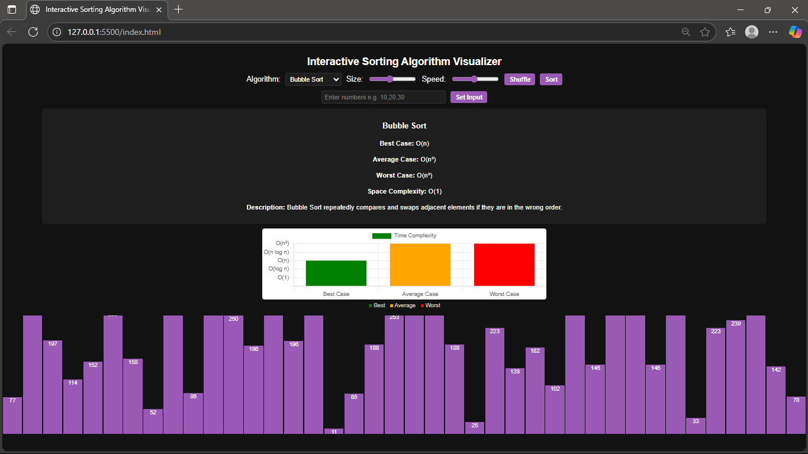

# 🎯 Interactive Sorting Algorithm Visualizer

A beginner-friendly project to visualize how various sorting algorithms work using animated bars and graphical complexity comparison.

---

## 📚 Features

- 🎞️ Visualizes 6 Sorting Algorithms:
  - Bubble Sort
  - Selection Sort
  - Insertion Sort
  - Merge Sort
  - Quick Sort
  - Heap Sort
- 🧠 Manual input option for custom arrays
- 📏 Adjustable speed and array size
- 📊 Graphical Time Complexity Comparison (Best, Average, Worst)
- 🎨 Clean and modern dark theme with purple styling

---

## 🚀 How to Use

1. **Download or clone** this repository.
2. Open `index.html` in your browser.
3. Select an algorithm from the dropdown.
4. Click **Shuffle** to generate a new array or manually enter values.
5. Adjust **size** and **speed** sliders.
6. Click **Sort** to see the visualization in action!

---

## 💻 Folder Structure

