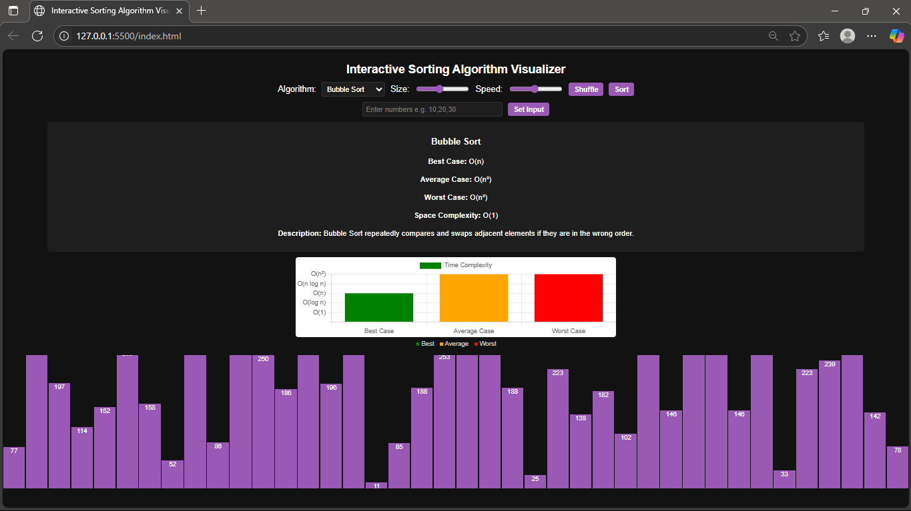

# 🎯 Interactive Sorting Algorithm Visualizer

A beginner-friendly project to visualize how various sorting algorithms work using animated bars and graphical complexity comparison.



---

## 📚 Features

- 🎞️ Visualizes 6 Sorting Algorithms:
  - Bubble Sort
  - Selection Sort
  - Insertion Sort
  - Merge Sort
  - Quick Sort
  - Heap Sort
- 🧠 Manual input option for custom arrays
- 📏 Adjustable speed and array size
- 📊 Graphical Time Complexity Comparison (Best, Average, Worst)
- 🎨 Clean and modern dark theme with purple styling

---

## 🚀 How to Use

1. **Download or clone** this repository.
2. Open `index.html` in your browser.
3. Select an algorithm from the dropdown.
4. Click **Shuffle** to generate a new array or manually enter values.
5. Adjust **size** and **speed** sliders.
6. Click **Sort** to see the visualization in action!

---

## 💻 Folder Structure


```text
sorting-visualizer/
├── index.html                 # Main HTML file  
├── style.css                  # Styling for the visualizer  
├── script.js                  # Main JavaScript logic  
├── screenshot.png             # Preview image for README  
└── algorithms/                # Folder containing individual sorting algorithm files  
    ├── bubbleSort.js  
    ├── selectionSort.js  
    ├── insertionSort.js  
    ├── mergeSort.js  
    ├── quickSort.js  
    └── heapSort.js  

```
## 📈 Technologies Used

- **HTML5** – Structure of the application  
- **CSS3** – Custom styling with a dark purple theme  
- **JavaScript (ES6)** – Core logic, animations, and DOM interaction  
- **Chart.js** – Used for visualizing time complexity in a bar chart  
- **VS Code Live Server** – For local testing and real-time updates
  
## 🙋‍♂️ Author

**Yash Singhal**  
2nd Year B.Tech CSE Student  
Lovely Professional University  
🔗 [GitHub](https://github.com/yash-singhal-02)
